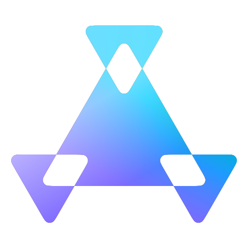

## Stats

<table>
  <tr>
    <td valign="center">
      <!-- GitHub Stats -->
      <picture>
        
      </picture>
      <!-- Top Langs -->
      <picture>
        
      </picture>
    </td>
    <!-- Icon -->
    <td valign="center">
      <a href="https://github.com/wiyco/profile/blob/develop/public/icon.svg?short_path=ca36c09">
        <picture>
          
        </picture>
      </a>
    </td>
  </tr>
</table>

## Templates

<section>
  <a href="https://github.com/wiyco/next-template">
    <picture>
      
    </picture>
  </a>
  <a href="https://github.com/wiyco/flutter_template">
    <picture>
      
    </picture>
  </a>
  <a href="https://github.com/wiyco/go-api-template">
    <picture>
      
    </picture>
  </a>
  <a href="https://github.com/wiyco/remix-template">
    <picture>
      
    </picture>
  </a>
</section>

## Contributions

<section>
  <a href="https://github.com/yamada-ui/yamada-ui">
    <picture>
      
    </picture>
  </a>
  <a href="https://github.com/nextui-org/nextui">
    <picture>
      
    </picture>
  </a>
  <a href="https://github.com/iputapp/lounas">
    <picture>
      
    </picture>
  </a>
  <a href="https://github.com/jesper-lindberg/Awake">
    <picture>
      
    </picture>
  </a>
  <a href="https://github.com/ytdl-org/youtube-dl/pull/30366#discussion_r770144843">
    <picture>
      
    </picture>
  </a>
</section>

## More

- https://wiyco.dev

### Latest coding practices

- https://github.com/wiyco/share
